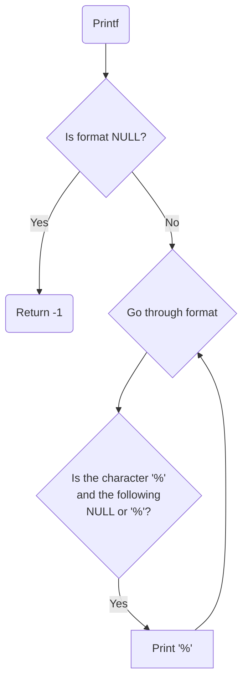

```mermaid
graph TD;
	Start(Printf)-->If0{Is format NULL?}
	If0-->|Yes|Return0(Return -1)
	If0-->|No|While0{Go through format}
	While0-->If1{Is the character '%'<br> and the following<br>NULL or '%'?}
	If1-->|Yes|Put0[Print '%']-->While0
```
