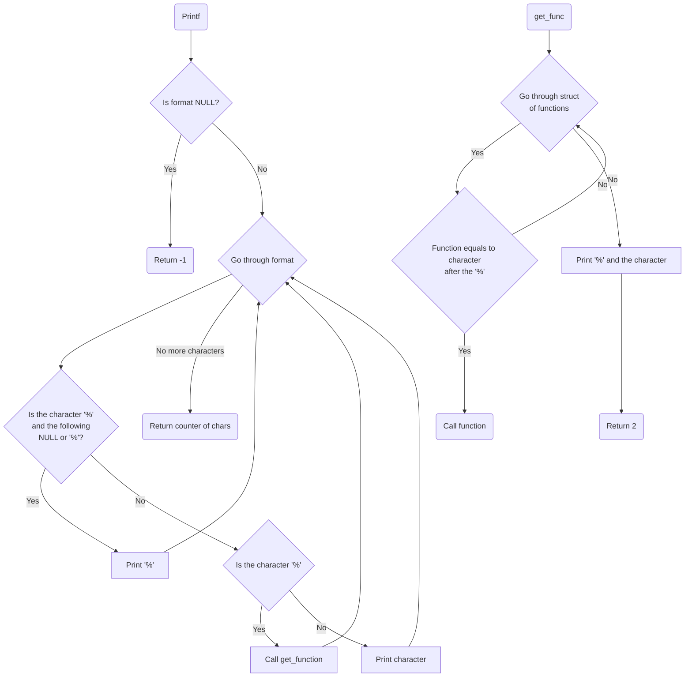

```mermaid
graph TD;
	Start0(Printf)-->If0{Is format NULL?}
	If0-->|Yes|Return0(Return -1)
	If0-->|No|While0{Go through format}
	While0-->If1{Is the character '%'<br> and the following<br>NULL or '%'?}
	If1-->|Yes|Put0[Print '%']-->While0
	If1-->|No|If2{Is the character '%'}
	If2-->|Yes|Call0[Call get_function]-->While0
	If2-->|No|Put1[Print character]-->While0
	While0-->|No more characters|Return1(Return counter of chars)
	
	
	Start1(get_func)-->For0{Go through struct<br>of functions}
	For0-->|Yes|If3{Function equals to character<br>after the '%'}-->|Yes|Return2(Call function)
	If3-->|No|For0
	For0-->|No|Put2[Print '%' and the character]-->Return3(Return 2)
```
